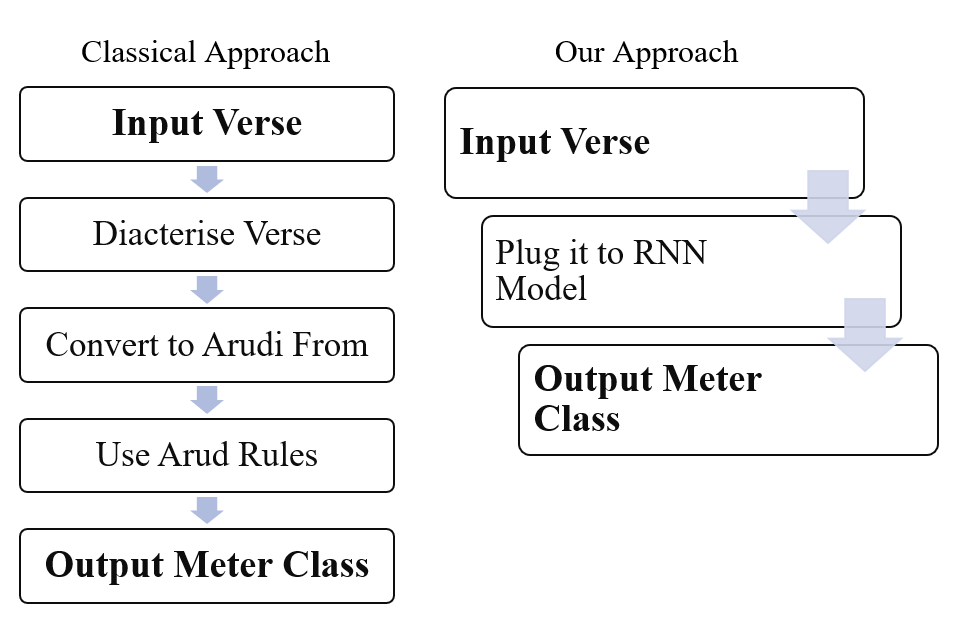
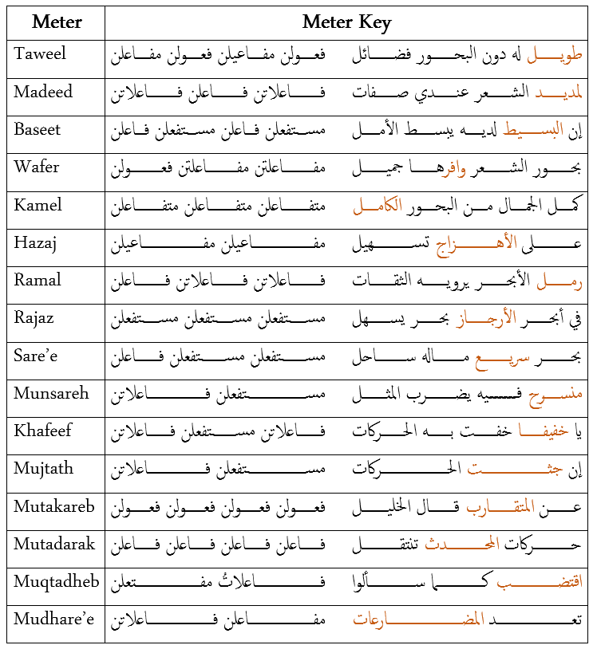
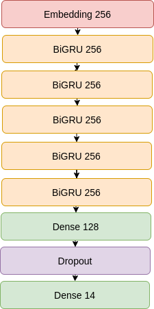

# AraMeter
This is a repository of the paper titled 
"Arabic Poetry Metric Classification Using Bidirectional Gated Recurrent Neural Networks". 

## Abstract
Poetry is an important component of any language. Much of a nation's history and culture are documented in poems. A poem has a rhythm flow which is quite different as compared to a prose. Each language has its own set of rhythmical structures for its poems, called meters.
Identifying the meters of Arabic poems is a lengthy and complicated process. To classify a poem's meter, the text of the poem should be encoded in a special Arudi form which needs complex rule-based transformations before another set of rules can be used to finally classify the meters. This paper introduces a novel method for classifying poem meters of Arabic poems using RNN-based deep learning. It bypasses the need to transform the poem to the Arudi form as well as the need to explicitly encode the complex rules that are usually followed to determine the meter. The presented method was evaluated on a large dataset collected specifically for this purpose. We are able to classify the poem meters with an accuracy of 94.32\% on an independent test set.

  

## Apporach 
We use Bidirectional GRU layers for training a character model for classifying 'baits' into one of 14 classes. Note that we discard the last two meters because we don't have enough data for them.

  

## Model Architecture

  

## Model Training 

Check the notebook `AraMeter.ipynb` for retraining the model. You can run it directly in [google colab](https://colab.research.google.com/github/zaidalyafeai/AraMeter/AraMeter.ipynb).

## Trained Model 

Check `full_verse.h5` for a the full trained model. You can load it directly using TensorFlow with the following command `model = tensorflow.keras.models.load_model('full_verse.h5')`

## Results
We acheive the following results compared to literature 
Source | Technique | Language | Dataset | Accuracy | Diacritics |
--- | --- | --- | --- |--- |--- 
Kurt and Kara (2012) | Similarity and flaw based  | Ottoman | 340 poems | 97.35% | N/A
Kaur and Saini (2017) |SVM | Punjabi |240 poems | 58.79% | N/A
Ismail et al. (2010) | Expert system | Arabic | 20 poems | 100.0%| Yes 
Alnagdawi et al. (2013)| Context free grammar | Arabic | 128 verses| 75.00%|Yes
Abuata and Al-Omari (2018)| Rule based algorithm|Arabic |417 verses |82.20% |Yes 
Our Approach | 5-BiGRU |Arabic | 55,440 verses |94.32% | No
## Examples 

<table>
<thead>
<tr>
<th align="center">Example</th>
<th align="right">Meter</th>
<th align="right">Probability</th>

</tr>
</thead>
<tbody>

<tr>
<td align="center">ما تردون على هذا المحب # دائبا يشكو إليكم في الكتب</td>
<td align="right">الرمل</td>
<td align="right">99.9 %</td>
</tr>  

<tr>
<td align="center">ولد الهدى فالكائنات ضياء # وفم الزمان تبسم وسناء</td>
<td align="right">الكامل</td>
<td align="right">99.5 %</td>
</tr>  

<tr>
<td align="center">ومن لم يمت بالسيف مات بغيره # تعددت الأسباب والموت واحد</td>
<td align="right">الطويل</td>
<td align="right">99.9 %</td>
</tr>  
 
<tr>
<td align="center">مَا مَضَى فَاتَ وَالْمُؤَمَّلُ غَيْبٌ # وَلَكَ السَّاعَةُ الَّتِيْ أَنْتَ فِيْهَا
</td>
<td align="right">الخفيف</td>
<td align="right">99.9 %</td>
</tr> 

<tr>
<td align="center">هزجنا في بواديكم # فأجزلتم عطايانا

</td>
<td align="right">الهزج</td>
<td align="right">98.0 %</td>
</tr> 
</tbody></table>

## Dataset 

The dataset is in the file `baits.zip` it is splitted into two files for training `train.txt` and testing `test.txt` and the labels of the meters are saved in the file `labels.txt`. The dataset was scrapped from [Aldiwan](https://www.aldiwan.net/) which is an encyclopedia of Arabic poetry where each poem is labeled by corrosponding poet, meter, era, etc. 

## Online Demo 

The model can be tested on the browser using the following [demo](https://zaidalyafeai.github.io/ARBML/Interfaces/Website/ArabicPoemMeterClassification/index.html). 

## License 

MIT 

## Reference 

`
@article{al2020meter,
  title={Meter Classification of Arabic Poems Using Deep Bidirectional Recurrent Neural Networks},
  author={Al-shaibani, Maged S and Alyafeai, Zaid and Ahmad, Irfan},
  journal={Pattern Recognition Letters},
  year={2020},
  publisher={Elsevier}
}
`
